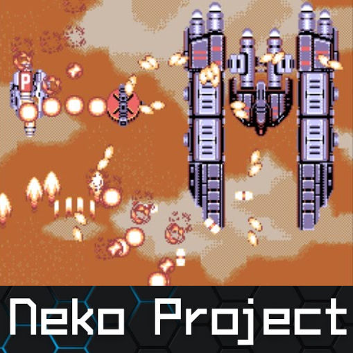

# NEC - PC-98 (Neko Project II)

### Description

Neko Project II is an excellent PC-98 emulator.

PC-98 is a lineup of Japanese 16-bit and 32-bit personal computers manufactured by NEC from 1982 to 2000.

### License

MIT

### Icon

### Fanart

Help make me fanart!

### Screenshots

Help make me screenshots!
